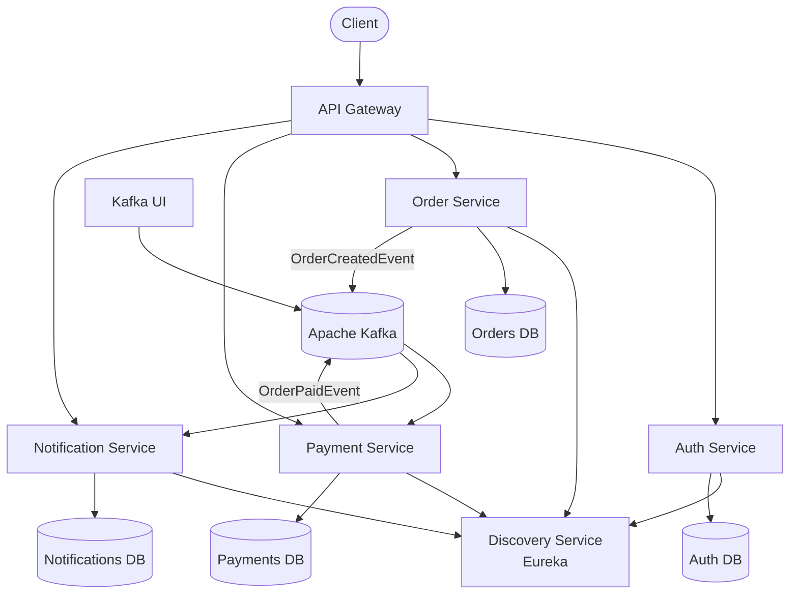

# Async Order System


> A microservices-based order processing system built with **Spring Boot**, featuring asynchronous communication through **Apache Kafka**, **JWT authentication**, service discovery with **Eureka**, and a fully containerized environment with **Docker Compose**.

## Overview

This project demonstrates an event-driven microservices architecture where independent services communicate through Kafka events while client requests are handled through a centralized API Gateway.

The system includes:

- JWT authentication with access and refresh tokens
- API Gateway
- Eureka service discovery
- Database-per-Service architecture
- Asynchronous Kafka-based communication
- PostgreSQL databases
- Docker Compose infrastructure
- Kafka UI
- OpenAPI / Swagger documentation
- Shared modules for events and security

## Architecture



## Event Flow

### Order Creation

```text
Client
  │
  ▼
API Gateway
  │
  ▼
Order Service
  │
  │ OrderCreatedEvent
  ▼
Kafka
  │
  ▼
Payment Service
```

### Payment Processing

```text
Payment Service
  │
  │ OrderPaidEvent
  ▼
Kafka
  │
  ▼
Notification Service
```

### Complete Flow

1. A user authenticates through the **Auth Service**.
2. The Auth Service issues an **Access Token** and **Refresh Token**.
3. The client sends authenticated requests through the **API Gateway**.
4. The **Order Service** stores the order in PostgreSQL.
5. The Order Service publishes an `OrderCreatedEvent` to Kafka.
6. The **Payment Service** consumes the event and creates a payment.
7. The Payment Service publishes an `OrderPaidEvent`.
8. The **Notification Service** consumes the event and creates a notification.

This keeps the business services loosely coupled and demonstrates asynchronous communication using Kafka.

## Services

| Service | Port | Responsibility |
|---|---:|---|
| API Gateway | 8080 | Single entry point for HTTP requests |
| Kafka UI | 8081 | Kafka monitoring and administration |
| Order Service | 8082 | Order creation and management |
| Payment Service | 8083 | Payment processing |
| Notification Service | 8084 | Notification creation |
| Auth Service | 8085 | Registration, login and JWT authentication |
| Discovery Service | 8761 | Service registration and discovery |

## Technology Stack

### Backend

- Java 17
- Spring Boot 3.5.x
- Spring Cloud 2025.0.x
- Spring Cloud Gateway
- Spring Security
- OAuth2 Resource Server
- Spring Data JPA
- Spring Cloud Netflix Eureka
- Spring Kafka
- Springdoc OpenAPI

### Infrastructure

- Apache Kafka 3.9
- Kafka UI
- PostgreSQL 16
- Docker
- Docker Compose

### Testing

- JUnit 5
- Mockito
- Spring Boot Test
- Testcontainers
- Embedded Kafka

## Project Structure

```text
async-order-system/
│
├── .mvn/
│
├── auth-service/
├── common-events/
├── common-security/
├── discovery-service/
├── gateway-service/
├── notification-service/
├── order-service/
├── payment-service/
│
├── docker-compose.yml
├── pom.xml
├── mvnw
├── mvnw.cmd
├── .env.example
├── .gitignore
└── README.md
```

### Shared Modules

- **common-events** — shared Kafka event classes
- **common-security** — shared security components

The project is organized as a **Maven multi-module project** with a root `pom.xml`.

## Running the Project

### Prerequisites

- Java 17+
- Docker
- Docker Compose

A separate Maven installation is **not required** because the project includes Maven Wrapper.

### 1. Clone the repository

```bash
git clone https://github.com/kokorj2000-hash/async-order-system.git

cd async-order-system
```

### 2. Create the environment file

#### Linux / macOS

```bash
cp .env.example .env
```

#### Windows

```cmd
copy .env.example .env
```

Configure the required values in `.env`.

Example:

```env
POSTGRES_USER=postgres
POSTGRES_PASSWORD=your_password

JWT_SECRET=your_jwt_secret

JWT_ACCESS_EXPIRATION=86400000
JWT_REFRESH_EXPIRATION=604800000
```

`.env` is intentionally excluded from Git.

### 3. Build the project

Build all modules using Maven Wrapper:

#### Windows

```cmd
.\mvnw.cmd clean install -DskipTests
```

#### Linux / macOS

```bash
./mvnw clean install -DskipTests
```

This builds all modules and produces the JAR files required by Docker.

### 4. Start the application

```bash
docker compose up --build
```

Docker Compose starts:

- PostgreSQL databases
- Apache Kafka
- Kafka UI
- Discovery Service
- API Gateway
- Auth Service
- Order Service
- Payment Service
- Notification Service

## Stop the Application

```bash
docker compose down
```

To remove containers and database volumes:

```bash
docker compose down -v
```

## Available Services

| Service | URL |
|---|---|
| API Gateway | http://localhost:8080 |
| Kafka UI | http://localhost:8081 |
| Order Service | http://localhost:8082 |
| Payment Service | http://localhost:8083 |
| Notification Service | http://localhost:8084 |
| Auth Service | http://localhost:8085 |
| Eureka Dashboard | http://localhost:8761 |

## Databases

Each business service owns its own PostgreSQL database.

| Service | Database | Port |
|---|---|---:|
| Auth Service | `auth_db` | 5435 |
| Order Service | `orders_db` | 5432 |
| Payment Service | `payments_db` | 5433 |
| Notification Service | `notifications_db` | 5434 |

This follows the **Database-per-Service** microservice pattern.

## Authentication

The project uses JWT-based authentication.

After a successful login, the Auth Service returns:

- Access Token
- Refresh Token

The API Gateway handles incoming requests while protected services validate JWT tokens using Spring Security.

```text
Client
  │
  │ Login
  ▼
Auth Service
  │
  ├── Access Token
  └── Refresh Token
         │
         ▼
    API Gateway
         │
         ▼
 Protected Services
```

## API Documentation

Swagger UI is available for services that expose OpenAPI documentation.

Example:

```text
http://localhost:8082/swagger-ui/index.html
```

The available endpoints depend on each service.

## Testing

The project contains unit and integration tests using Spring Boot Test, Mockito, Testcontainers and Kafka testing tools.

Run all tests:

### Windows

```cmd
.\mvnw.cmd test
```

### Linux / macOS

```bash
./mvnw test
```

Run tests for a specific service:

```bash
cd order-service
```

```bash
../mvnw test
```

## Logging

The application contains business-event logging for important operations, including:

- Order creation
- Kafka event publishing
- Kafka event consumption
- Payment creation
- Notification creation
- Successful operations
- Access-denied attempts
- Missing resources

Example:

```text
Order saved to database. orderId=1, userId=1
Sending OrderCreatedEvent to Kafka.
OrderCreatedEvent received. orderId=1
Payment created from OrderCreatedEvent.
```

## Fault Tolerance Demonstration

The asynchronous architecture allows individual services to be temporarily unavailable while Kafka retains unprocessed events.

For example, a consumer service can be stopped while new events continue to be published. After the service is restarted, Kafka can deliver pending messages according to the consumer group's offsets.

This demonstrates:

- independent microservices
- asynchronous communication
- persistent Kafka messages
- recovery of consumers after temporary service interruption

## What I Learned

Building this project provided practical experience with:

- designing microservice architecture
- implementing asynchronous communication with Kafka
- securing APIs with JWT authentication
- configuring Spring Cloud Gateway and Eureka
- implementing the Database-per-Service pattern
- orchestrating services with Docker Compose
- writing unit and integration tests
- using Testcontainers
- working with Kafka consumers and offsets
- structuring a multi-module Maven project

## Future Improvements

Potential production-oriented improvements include:

- centralized configuration with Spring Cloud Config
- distributed tracing
- metrics and monitoring
- retry policies
- Dead Letter Topics (DLT)
- database migrations with Flyway

## License

This project was created for educational and portfolio purposes.